# ADS 2023 projekt č. 2
Cílem projektu je vytvořit funkční aplikaci pro zpracování dat ze senzorů pro měření teploty. Data budou produkována do Kafka clusteru běžícího v Kubernetes a z něj čtena aplikací napsanou v libovolném programovacím jazyce, která poběží v Kubernetes také.
Projekt se nebude odevzdávat, ale bude se prezentovat osobně.
## Požadavky:
Spusťte lokální Kubernetes cluster na svém (jednom) stroji.
Vytvořte v Kubernetes Kafka cluster se třemi brokery. Perzistenci dat v Kubernetes řešit nemusíte. Nápověda pokud použijete Docker image Kafky od Bitnami: parametr KAFKA_CFG_LISTENERS se vztahuje vždy k portům uvnitř kontejneru, takže i pokud definujete nějaké EXTERNAL rozhraní Kafky, tak port v tomto parametru uveďte stejně vnitřní.
Vytvořte v Kafka clusteru topic "temperature" se čtyřmi partition a třemi replikami.
Ověřte, že cluster funguje i při ztrátě (restart nebo dlouhodobé vypnutí) jednoho nebo dvou brokerů.
Vytvořte v libovolném programovacím jazyce aplikaci “temperature_reader”, která:
Bude konzumovat zprávy z Kafka clusteru z topicu “temperature”. Použité řešení musí zůstat funkční při výpadku libovolných brokerů Kafka clusteru.
Formát zprávy si můžete zvolit vlastní, ale musí obsahovat minimálně textový identifikátor senzoru a také hodnotu naměřené teploty (ve °C, s přesností na desetiny a v rozsahu vhodném pro běžnou domácnost - mimo tento rozsah musí zprávy zahazovat).
Bude číst pouze nejnovější zprávy z Kafky.
Na výstupu bude vypisovat aplikace ke každé zprávě unikátní identifikátor instance aplikace a za ním obsah načtené zprávy.
Zajistěte, aby aplikace temperature_reader běžela v Kubernetu ve dvou instancích.
Zajistěte, aby parametr “topic” pro temperature_reader byl konfigurovatelný z Kubernetes.
Vyzkoušejte rolling update aplikace temperature_reader.
## Diagram

## Přístup k dockeru v minikube (Windows)
```bash
& minikube -p minikube docker-env --shell powershell | Invoke-Expression
```
## Přístup k dockeru v minikube (Linux)
```cmd
eval $(minikube docker-env)
```
## Sestavení image producera verze 1
```cmd
docker build -t producer:v1 .\apps\producer\
```
## Sestavení image consumera verze 1
```cmd
docker build -t temperature_reader:v1 .\apps\temperature_reader\v1
```
## Sestavení image consumera verze 2
```cmd
docker build -t temperature_reader:v2 .\apps\temperature_reader\v2
```
## Spuštění Kafky
```cmd
kubectl apply -f .\kubernetes\kafka.yaml
```
## Přípojení do Podu
```cmd
kubectl exec --stdin --tty kafka-2 -- /bin/bash
```
## Vytvoření topiku
```bash
kafka-topics.sh --create --bootstrap-server kafka-svc-external:9092 --topic temperature --partitions 4 --replication-factor 3
```
## Spuštění producera CLI
```bash
kafka-console-producer.sh --bootstrap-server kafka-svc-external:9092 --topic temperature
```
## Spuštění producera 
```cmd
kubectl apply -f .\kubernetes\producer.yaml
```
## Spuštění aplikace verze 1 
```cmd
kubectl apply -f .\kubernetes\temperature_reader_v1.yaml
```
## Spuštění aplikace verze 2 (Rolling update)
```cmd
kubectl apply -f .\kubernetes\temperature_reader_v2.yaml
```
## Rollback
```cmd
kubectl rollout undo deployment temperature-reader
```
## Zdroje
https://learnk8s.io/kafka-ha-kubernetes  
https://github.com/IBM/kraft-mode-kafka-on-kubernetes/tree/main
